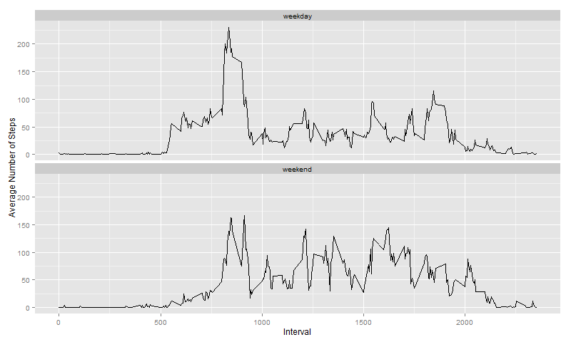

## Loading and preprocessing the data
Load data from file `activity.csv`:
```{r loadData}
data <- read.csv("activity.csv", header=T, stringsAsFactors=F)
```

Remove data with missing value:
```{r}
ok <- complete.cases(data)
data_ok <- data[ok,]
```

## What is mean total number of steps taken per day?
First, calculate the total number of steps taken each day:
```{r}
sum_per_day <- tapply(data_ok$steps, as.factor(data_ok$date), sum)
sum_per_day
```

Then make a histogram of sum_per_day:
```{r}
hist(sum_per_day, xlab="Total Number of Steps", main="")
```

Calculate and report the **mean** and **median** total number of steps taken per day:
```{r}
mean(sum_per_day)
median(sum_per_day)
```

## What is the average daily activity pattern?
First, calculate 5-minute interval and the average number of steps taken, averaged across all days:
```{r}
avg_per_interval <- tapply(data_ok$steps, as.factor(data_ok$interval), mean)
head(avg_per_interval,100)  # print first 100 resuts
```

Then make a time series plot:
```{r}
plot(names(avg_per_interval), 
     avg_per_interval, 
     type="l", 
     xlab="Interval", 
     ylab="Average Number of Steps")
```

We can get the 5-minute interval, on average across all the days in the dataset, which contains the maximum number of steps:
```{r}
avg_per_interval[which.max(avg_per_interval)]
```

## Imputing missing values
First, calculate and report the total number of missing values in the dataset (i.e. the total number of rows with NAs):
```{r}
sum(!ok)
```

Second, devise a strategy for filling in all of the missing values in the dataset. Here we use **the mean for that 5-minute interval** to fill the missing values:
```{r}
data_imputing <- data
data_imputing$steps <- ifelse(is.na(data_imputing$steps), 
                              round(avg_per_interval[as.character(data_imputing$interval)]) , 
                              data_imputing$steps)
```

We have already created a new dataset `data_imputing` that is equal to the original dataset but with the missing data filled in. We can check it:
```{r}
# first 20 rows of original dataset
head(data, 20) 
```

```{r}
# first 20 rows of new dataset
head(data_imputing, 20) 
```

Finally, make a histogram of the total number of steps taken each day with new dataset:
```{r}
# calculate the total number of steps taken each day with new dataset
sum_per_day_imputing <- tapply(data_imputing$steps, 
                               as.factor(data_imputing$date), sum)
hist(sum_per_day_imputing, xlab="Total Number of Steps", main="")
```

And Calculate and report the **mean** and **median** total number of steps taken per day with new dataset:
```{r}
mean(sum_per_day_imputing)
median(sum_per_day_imputing)
```
We can see the mean and median(10766, 10762) is very close to values before imputing missing data(10766, 10765). This is because we `round` the mean of 5-minute interval to fill in missing values. If we use different strategy such as `ceiling` or `floor`, the new mean and median will be more away from values before imputing. Let's try it:
```{r}
# ceiling the mean
data_imputing_ceil <- data
data_imputing_ceil$steps <- ifelse(is.na(data_imputing_ceil$steps), 
                                   ceiling(avg_per_interval[as.character(data_imputing_ceil$interval)]) , 
                                   data_imputing_ceil$steps)
sum_per_day_imputing_ceil <- tapply(data_imputing_ceil$steps, 
                                    as.factor(data_imputing_ceil$date), sum)
mean(sum_per_day_imputing_ceil)
median(sum_per_day_imputing_ceil)
```

```{r}
# floor the mean
data_imputing_floor <- data
data_imputing_floor$steps <- ifelse(is.na(data_imputing_floor$steps), 
                                    floor(avg_per_interval[as.character(data_imputing_floor$interval)]) , 
                                    data_imputing_floor$steps)
sum_per_day_imputing_floor <- tapply(data_imputing_floor$steps, 
                                     as.factor(data_imputing_floor$date), sum)
mean(sum_per_day_imputing_floor)
median(sum_per_day_imputing_floor)
```

## Are there differences in activity patterns between weekdays and weekends?
First, we need to create a new factor variable in the dataset with two levels – “weekday” and “weekend” indicating whether a given date is a weekday or weekend day.
```{r message=FALSE, warning=FALSE}
data_imputing2 <- apply(data_imputing, 1, function(x) {
  wd <- weekdays(as.Date(x["date"], "%Y-%m-%d"))
  if (wd == "Saturday" | wd == "Sunday")
    x$wd <- "weekend"
  else
    x$wd <- "weekday"
  x
})
```
But `data_imputing2` is a `list` and we need to cast it to a `data frame`. Here we use a method provided by [http://stackoverflow.com/questions/4512465/what-is-the-most-efficient-way-to-cast-a-list-as-a-data-frame?rq=1](http://stackoverflow.com/questions/4512465/what-is-the-most-efficient-way-to-cast-a-list-as-a-data-frame?rq=1) to do it:
```{r}
f = function(x) function(i) unlist(lapply(x, `[[`, i), use.names=FALSE)
data_imputing2 <- as.data.frame(Map(f(data_imputing2), names(data_imputing2[[1]])))
head(data_imputing2, 20)  # print first 20 rows
```

Make a panel plot containing a time series plot of the 5-minute interval (x-axis) and the average number of steps taken, averaged across all weekday days or weekend days (y-axis).

To do it, we need to calculate the average by weekday days and weekend days:
```{r}
avg_per_interval_wd <- tapply(as.numeric(data_imputing2$steps), 
                              list(data_imputing2$interval, data_imputing2$wd), 
                              mean)
```
Since this is **not** a tidy dataset because the value "weekday" and "weekend" are factors. So we need to reshape it  by melting. We use package `reshape2` to do it:
```{r message=FALSE, warning=FALSE}
library(reshape2)
df <- data.frame(avg_per_interval_wd)
df$interval <- rownames(df)
df_m <- melt(df, id=c("interval"))
head(df_m, 20)
```

Finally, we can plot the dataset using package `gglot2`:
```{r message=FALSE, warning=FALSE, results='hide', fig.show='hide'}
library(ggplot2)
as.factor(df_m$variable)
# plot and print to a png file
g <- ggplot(df_m, aes(as.numeric(interval), value))
p <- g + geom_line(aes(group=variable)) + 
         facet_grid(variable ~ .) + 
         scale_x_discrete(breaks=seq(0, 2355, by=100)) +
         xlab("Interval") +
         ylab("Average Number of Steps")
print(p)
```
<!-- Because of some technical issue, knit cannot show plot correctly. 
     So we create the picture file first. 
-->
