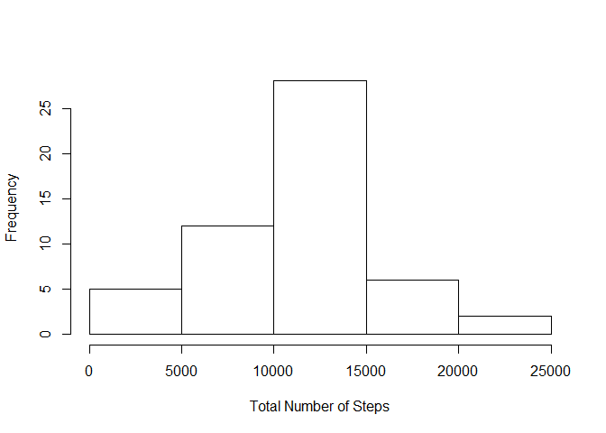
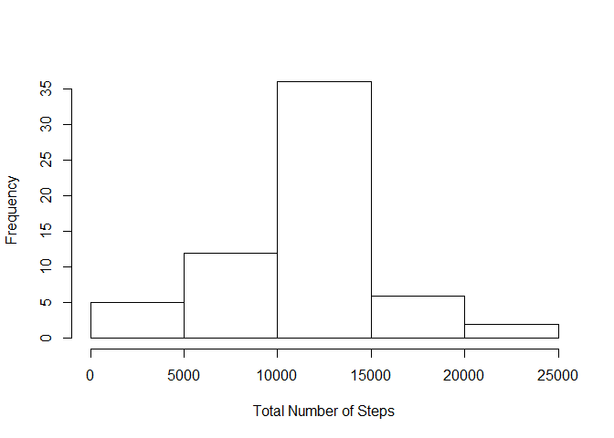

# Reproducible Research: Peer Assessment 1


## Loading and preprocessing the data
Load data from file `activity.csv`:

```r
data <- read.csv("activity.csv", header=T, stringsAsFactors=F)
```

Remove data with missing value:

```r
ok <- complete.cases(data)
data_ok <- data[ok,]
```

## What is mean total number of steps taken per day?
First, calculate the total number of steps taken each day:

```r
sum_per_day <- tapply(data_ok$steps, as.factor(data_ok$date), sum)
sum_per_day
```

```
## 2012-10-02 2012-10-03 2012-10-04 2012-10-05 2012-10-06 2012-10-07 
##        126      11352      12116      13294      15420      11015 
## 2012-10-09 2012-10-10 2012-10-11 2012-10-12 2012-10-13 2012-10-14 
##      12811       9900      10304      17382      12426      15098 
## 2012-10-15 2012-10-16 2012-10-17 2012-10-18 2012-10-19 2012-10-20 
##      10139      15084      13452      10056      11829      10395 
## 2012-10-21 2012-10-22 2012-10-23 2012-10-24 2012-10-25 2012-10-26 
##       8821      13460       8918       8355       2492       6778 
## 2012-10-27 2012-10-28 2012-10-29 2012-10-30 2012-10-31 2012-11-02 
##      10119      11458       5018       9819      15414      10600 
## 2012-11-03 2012-11-05 2012-11-06 2012-11-07 2012-11-08 2012-11-11 
##      10571      10439       8334      12883       3219      12608 
## 2012-11-12 2012-11-13 2012-11-15 2012-11-16 2012-11-17 2012-11-18 
##      10765       7336         41       5441      14339      15110 
## 2012-11-19 2012-11-20 2012-11-21 2012-11-22 2012-11-23 2012-11-24 
##       8841       4472      12787      20427      21194      14478 
## 2012-11-25 2012-11-26 2012-11-27 2012-11-28 2012-11-29 
##      11834      11162      13646      10183       7047
```

Then make a histogram of sum_per_day:

```r
hist(sum_per_day, xlab="Total Number of Steps", main="")
```

 

Calculate and report the **mean** and **median** total number of steps taken per day:

```r
mean(sum_per_day)
```

```
## [1] 10766
```

```r
median(sum_per_day)
```

```
## [1] 10765
```

## What is the average daily activity pattern?
First, calculate 5-minute interval and the average number of steps taken, averaged across all days:

```r
avg_per_interval <- tapply(data_ok$steps, as.factor(data_ok$interval), mean)
head(avg_per_interval,100)  # print first 100 resuts
```

```
##         0         5        10        15        20        25        30 
##   1.71698   0.33962   0.13208   0.15094   0.07547   2.09434   0.52830 
##        35        40        45        50        55       100       105 
##   0.86792   0.00000   1.47170   0.30189   0.13208   0.32075   0.67925 
##       110       115       120       125       130       135       140 
##   0.15094   0.33962   0.00000   1.11321   1.83019   0.16981   0.16981 
##       145       150       155       200       205       210       215 
##   0.37736   0.26415   0.00000   0.00000   0.00000   1.13208   0.00000 
##       220       225       230       235       240       245       250 
##   0.00000   0.13208   0.00000   0.22642   0.00000   0.00000   1.54717 
##       255       300       305       310       315       320       325 
##   0.94340   0.00000   0.00000   0.00000   0.00000   0.20755   0.62264 
##       330       335       340       345       350       355       400 
##   1.62264   0.58491   0.49057   0.07547   0.00000   0.00000   1.18868 
##       405       410       415       420       425       430       435 
##   0.94340   2.56604   0.00000   0.33962   0.35849   4.11321   0.66038 
##       440       445       450       455       500       505       510 
##   3.49057   0.83019   3.11321   1.11321   0.00000   1.56604   3.00000 
##       515       520       525       530       535       540       545 
##   2.24528   3.32075   2.96226   2.09434   6.05660  16.01887  18.33962 
##       550       555       600       605       610       615       620 
##  39.45283  44.49057  31.49057  49.26415  53.77358  63.45283  49.96226 
##       625       630       635       640       645       650       655 
##  47.07547  52.15094  39.33962  44.01887  44.16981  37.35849  49.03774 
##       700       705       710       715       720       725       730 
##  43.81132  44.37736  50.50943  54.50943  49.92453  50.98113  55.67925 
##       735       740       745       750       755       800       805 
##  44.32075  52.26415  69.54717  57.84906  56.15094  73.37736  68.20755 
##       810       815 
## 129.43396 157.52830
```

Then make a time series plot:

```r
plot(names(avg_per_interval), 
     avg_per_interval, 
     type="l", 
     xlab="Interval", 
     ylab="Average Number of Steps")
```

 

We can get the 5-minute interval, on average across all the days in the dataset, which contains the maximum number of steps:

```r
avg_per_interval[which.max(avg_per_interval)]
```

```
##   835 
## 206.2
```

## Imputing missing values
First, calculate and report the total number of missing values in the dataset (i.e. the total number of rows with NAs):

```r
sum(!ok)
```

```
## [1] 2304
```

Second, devise a strategy for filling in all of the missing values in the dataset. Here we use **the mean for that 5-minute interval** to fill the missing values:

```r
data_imputing <- data
data_imputing$steps <- ifelse(is.na(data_imputing$steps), 
                              round(avg_per_interval[as.character(data_imputing$interval)]) , 
                              data_imputing$steps)
```

We have already created a new dataset `data_imputing` that is equal to the original dataset but with the missing data filled in. We can check it:

```r
# first 20 rows of original dataset
head(data, 20) 
```

```
##    steps       date interval
## 1     NA 2012-10-01        0
## 2     NA 2012-10-01        5
## 3     NA 2012-10-01       10
## 4     NA 2012-10-01       15
## 5     NA 2012-10-01       20
## 6     NA 2012-10-01       25
## 7     NA 2012-10-01       30
## 8     NA 2012-10-01       35
## 9     NA 2012-10-01       40
## 10    NA 2012-10-01       45
## 11    NA 2012-10-01       50
## 12    NA 2012-10-01       55
## 13    NA 2012-10-01      100
## 14    NA 2012-10-01      105
## 15    NA 2012-10-01      110
## 16    NA 2012-10-01      115
## 17    NA 2012-10-01      120
## 18    NA 2012-10-01      125
## 19    NA 2012-10-01      130
## 20    NA 2012-10-01      135
```


```r
# first 20 rows of new dataset
head(data_imputing, 20) 
```

```
##    steps       date interval
## 1      2 2012-10-01        0
## 2      0 2012-10-01        5
## 3      0 2012-10-01       10
## 4      0 2012-10-01       15
## 5      0 2012-10-01       20
## 6      2 2012-10-01       25
## 7      1 2012-10-01       30
## 8      1 2012-10-01       35
## 9      0 2012-10-01       40
## 10     1 2012-10-01       45
## 11     0 2012-10-01       50
## 12     0 2012-10-01       55
## 13     0 2012-10-01      100
## 14     1 2012-10-01      105
## 15     0 2012-10-01      110
## 16     0 2012-10-01      115
## 17     0 2012-10-01      120
## 18     1 2012-10-01      125
## 19     2 2012-10-01      130
## 20     0 2012-10-01      135
```

Finally, make a histogram of the total number of steps taken each day with new dataset:

```r
# calculate the total number of steps taken each day with new dataset
sum_per_day_imputing <- tapply(data_imputing$steps, 
                               as.factor(data_imputing$date), sum)
hist(sum_per_day_imputing, xlab="Total Number of Steps", main="")
```

 

And Calculate and report the **mean** and **median** total number of steps taken per day with new dataset:

```r
mean(sum_per_day_imputing)
```

```
## [1] 10766
```

```r
median(sum_per_day_imputing)
```

```
## [1] 10762
```
We can see the mean and median(10766, 10762) is very close to values before imputing missing data(10766, 10765). This is because we `round` the mean of 5-minute interval to fill in missing values. If we use different strategy such as `ceiling` or `floor`, the new mean and median will be more away from values before imputing. Let's try it:

```r
# ceiling the mean
data_imputing_ceil <- data
data_imputing_ceil$steps <- ifelse(is.na(data_imputing_ceil$steps), 
                                   ceiling(avg_per_interval[as.character(data_imputing_ceil$interval)]) , 
                                   data_imputing_ceil$steps)
sum_per_day_imputing_ceil <- tapply(data_imputing_ceil$steps, 
                                    as.factor(data_imputing_ceil$date), sum)
mean(sum_per_day_imputing_ceil)
```

```
## [1] 10785
```

```r
median(sum_per_day_imputing_ceil)
```

```
## [1] 10909
```


```r
# floor the mean
data_imputing_floor <- data
data_imputing_floor$steps <- ifelse(is.na(data_imputing_floor$steps), 
                                    floor(avg_per_interval[as.character(data_imputing_floor$interval)]) , 
                                    data_imputing_floor$steps)
sum_per_day_imputing_floor <- tapply(data_imputing_floor$steps, 
                                     as.factor(data_imputing_floor$date), sum)
mean(sum_per_day_imputing_floor)
```

```
## [1] 10750
```

```r
median(sum_per_day_imputing_floor)
```

```
## [1] 10641
```

## Are there differences in activity patterns between weekdays and weekends?
First, we need to create a new factor variable in the dataset with two levels – “weekday” and “weekend” indicating whether a given date is a weekday or weekend day.

```r
data_imputing2 <- apply(data_imputing, 1, function(x) {
  wd <- weekdays(as.Date(x["date"], "%Y-%m-%d"))
  if (wd == "Saturday" | wd == "Sunday")
    x$wd <- "weekend"
  else
    x$wd <- "weekday"
  x
})
```
But `data_imputing2` is a `list` and we need to cast it to a `data frame`. Here we use a method provided by [http://stackoverflow.com/questions/4512465/what-is-the-most-efficient-way-to-cast-a-list-as-a-data-frame?rq=1](http://stackoverflow.com/questions/4512465/what-is-the-most-efficient-way-to-cast-a-list-as-a-data-frame?rq=1) to do it:

```r
f = function(x) function(i) unlist(lapply(x, `[[`, i), use.names=FALSE)
data_imputing2 <- as.data.frame(Map(f(data_imputing2), names(data_imputing2[[1]])))
head(data_imputing2, 20)  # print first 20 rows
```

```
##    steps       date interval      wd
## 1      2 2012-10-01        0 weekday
## 2      0 2012-10-01        5 weekday
## 3      0 2012-10-01       10 weekday
## 4      0 2012-10-01       15 weekday
## 5      0 2012-10-01       20 weekday
## 6      2 2012-10-01       25 weekday
## 7      1 2012-10-01       30 weekday
## 8      1 2012-10-01       35 weekday
## 9      0 2012-10-01       40 weekday
## 10     1 2012-10-01       45 weekday
## 11     0 2012-10-01       50 weekday
## 12     0 2012-10-01       55 weekday
## 13     0 2012-10-01      100 weekday
## 14     1 2012-10-01      105 weekday
## 15     0 2012-10-01      110 weekday
## 16     0 2012-10-01      115 weekday
## 17     0 2012-10-01      120 weekday
## 18     1 2012-10-01      125 weekday
## 19     2 2012-10-01      130 weekday
## 20     0 2012-10-01      135 weekday
```

Make a panel plot containing a time series plot of the 5-minute interval (x-axis) and the average number of steps taken, averaged across all weekday days or weekend days (y-axis).

To do it, we need to calculate the average by weekday days and weekend days:

```r
avg_per_interval_wd <- tapply(as.numeric(data_imputing2$steps), 
                              list(data_imputing2$interval, data_imputing2$wd), 
                              mean)
```
Since this is **not** a tidy dataset because the value "weekday" and "weekend" are factors. So we need to reshape it  by melting. We use package `reshape2` to do it:

```r
library(reshape2)
df <- data.frame(avg_per_interval_wd)
df$interval <- rownames(df)
df_m <- melt(df, id=c("interval"))
head(df_m, 20)
```

```
##    interval variable value
## 1         0  weekday 2.754
## 2         5  weekday 1.295
## 3        10  weekday 1.115
## 4        15  weekday 1.131
## 5        20  weekday 1.066
## 6        25  weekday 3.082
## 7        30  weekday 1.590
## 8        35  weekday 1.885
## 9        40  weekday 1.000
## 10       45  weekday 2.410
## 11       50  weekday 1.262
## 12       55  weekday 1.115
## 13      100  weekday 1.279
## 14      105  weekday 1.721
## 15      110  weekday 1.131
## 16      115  weekday 1.295
## 17      120  weekday 1.000
## 18      125  weekday 2.098
## 19      130  weekday 2.852
## 20      135  weekday 1.148
```

Finally, we can plot the dataset using package `gglot2`:

```r
library(ggplot2)
as.factor(df_m$variable)
# plot and print to a png file
g <- ggplot(df_m, aes(as.numeric(interval), value))
p <- g + geom_line(aes(group=variable)) + 
         facet_grid(variable ~ .) + 
         scale_x_discrete(breaks=seq(0, 2355, by=100)) +
         xlab("Interval") +
         ylab("Average Number of Steps")
print(p)
```
<!-- Because of some technical issue, knit cannot show plot correctly. 
     So we create the picture file first. 
-->

