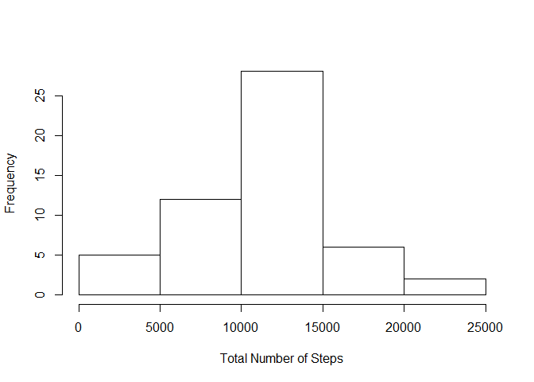
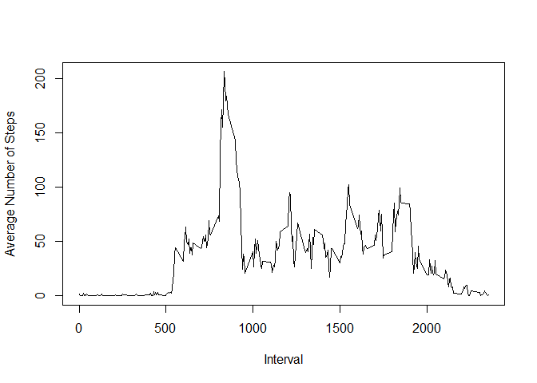
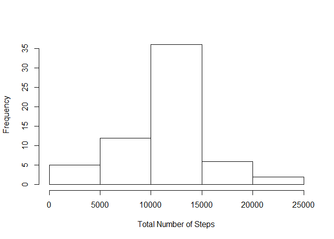
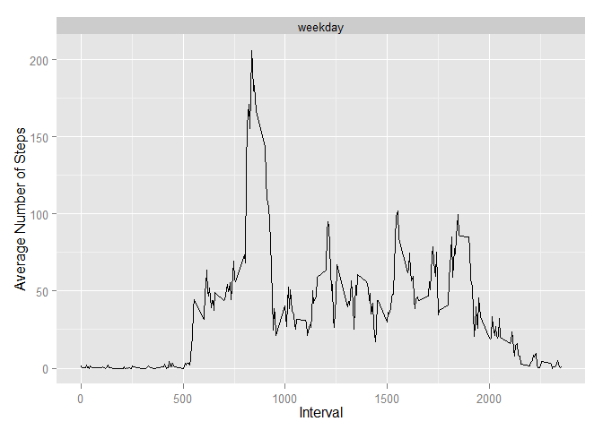
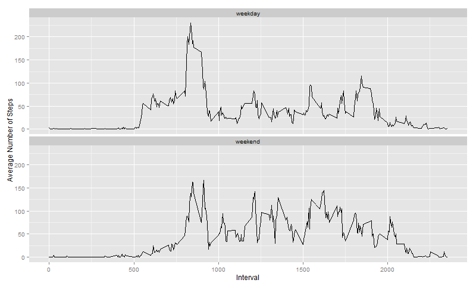

# Reproducible Research: Peer Assessment 1


## Loading and preprocessing the data
Load data from file `activity.csv`:

```r
data <- read.csv("activity.csv", header=T, stringsAsFactors=F)
```

Remove data with missing value:

```r
ok <- complete.cases(data)
data_ok <- data[ok,]
```

## What is mean total number of steps taken per day?
First, calculate the total number of steps taken each day:

```r
sum_per_day <- tapply(data_ok$steps, as.factor(data_ok$date), sum)
sum_per_day
```

```
## 2012-10-02 2012-10-03 2012-10-04 2012-10-05 2012-10-06 2012-10-07 
##        126      11352      12116      13294      15420      11015 
## 2012-10-09 2012-10-10 2012-10-11 2012-10-12 2012-10-13 2012-10-14 
##      12811       9900      10304      17382      12426      15098 
## 2012-10-15 2012-10-16 2012-10-17 2012-10-18 2012-10-19 2012-10-20 
##      10139      15084      13452      10056      11829      10395 
## 2012-10-21 2012-10-22 2012-10-23 2012-10-24 2012-10-25 2012-10-26 
##       8821      13460       8918       8355       2492       6778 
## 2012-10-27 2012-10-28 2012-10-29 2012-10-30 2012-10-31 2012-11-02 
##      10119      11458       5018       9819      15414      10600 
## 2012-11-03 2012-11-05 2012-11-06 2012-11-07 2012-11-08 2012-11-11 
##      10571      10439       8334      12883       3219      12608 
## 2012-11-12 2012-11-13 2012-11-15 2012-11-16 2012-11-17 2012-11-18 
##      10765       7336         41       5441      14339      15110 
## 2012-11-19 2012-11-20 2012-11-21 2012-11-22 2012-11-23 2012-11-24 
##       8841       4472      12787      20427      21194      14478 
## 2012-11-25 2012-11-26 2012-11-27 2012-11-28 2012-11-29 
##      11834      11162      13646      10183       7047
```

Then make a histogram of sum_per_day:

```r
hist(sum_per_day, xlab="Total Number of Steps", main="")
```

 

Calculate and report the **mean** and **median** total number of steps taken per day:

```r
mean(sum_per_day)
```

```
## [1] 10766.19
```

```r
median(sum_per_day)
```

```
## [1] 10765
```

## What is the average daily activity pattern?
First, calculate 5-minute interval and the average number of steps taken, averaged across all days:

```r
avg_per_interval <- tapply(data_ok$steps, as.factor(data_ok$interval), mean)
head(avg_per_interval,100)  # print first 100 resuts
```

```
##           0           5          10          15          20          25 
##   1.7169811   0.3396226   0.1320755   0.1509434   0.0754717   2.0943396 
##          30          35          40          45          50          55 
##   0.5283019   0.8679245   0.0000000   1.4716981   0.3018868   0.1320755 
##         100         105         110         115         120         125 
##   0.3207547   0.6792453   0.1509434   0.3396226   0.0000000   1.1132075 
##         130         135         140         145         150         155 
##   1.8301887   0.1698113   0.1698113   0.3773585   0.2641509   0.0000000 
##         200         205         210         215         220         225 
##   0.0000000   0.0000000   1.1320755   0.0000000   0.0000000   0.1320755 
##         230         235         240         245         250         255 
##   0.0000000   0.2264151   0.0000000   0.0000000   1.5471698   0.9433962 
##         300         305         310         315         320         325 
##   0.0000000   0.0000000   0.0000000   0.0000000   0.2075472   0.6226415 
##         330         335         340         345         350         355 
##   1.6226415   0.5849057   0.4905660   0.0754717   0.0000000   0.0000000 
##         400         405         410         415         420         425 
##   1.1886792   0.9433962   2.5660377   0.0000000   0.3396226   0.3584906 
##         430         435         440         445         450         455 
##   4.1132075   0.6603774   3.4905660   0.8301887   3.1132075   1.1132075 
##         500         505         510         515         520         525 
##   0.0000000   1.5660377   3.0000000   2.2452830   3.3207547   2.9622642 
##         530         535         540         545         550         555 
##   2.0943396   6.0566038  16.0188679  18.3396226  39.4528302  44.4905660 
##         600         605         610         615         620         625 
##  31.4905660  49.2641509  53.7735849  63.4528302  49.9622642  47.0754717 
##         630         635         640         645         650         655 
##  52.1509434  39.3396226  44.0188679  44.1698113  37.3584906  49.0377358 
##         700         705         710         715         720         725 
##  43.8113208  44.3773585  50.5094340  54.5094340  49.9245283  50.9811321 
##         730         735         740         745         750         755 
##  55.6792453  44.3207547  52.2641509  69.5471698  57.8490566  56.1509434 
##         800         805         810         815 
##  73.3773585  68.2075472 129.4339623 157.5283019
```

Then make a time series plot:

```r
plot(names(avg_per_interval), 
     avg_per_interval, 
     type="l", 
     xlab="Interval", 
     ylab="Average Number of Steps")
```

 

We can get the 5-minute interval, on average across all the days in the dataset, which contains the maximum number of steps:

```r
avg_per_interval[which.max(avg_per_interval)]
```

```
##      835 
## 206.1698
```

## Imputing missing values
First, calculate and report the total number of missing values in the dataset (i.e. the total number of rows with NAs):

```r
sum(!ok)
```

```
## [1] 2304
```

Second, devise a strategy for filling in all of the missing values in the dataset. Here we use **the mean for that 5-minute interval** to fill the missing values:

```r
data_imputing <- data
data_imputing$steps <- ifelse(is.na(data_imputing$steps), 
                              round(avg_per_interval[as.character(data_imputing$interval)]) , 
                              data_imputing$steps)
```

We have already created a new dataset `data_imputing` that is equal to the original dataset but with the missing data filled in. We can check it:

```r
# first 20 rows of original dataset
head(data, 20) 
```

```
##    steps       date interval
## 1     NA 2012-10-01        0
## 2     NA 2012-10-01        5
## 3     NA 2012-10-01       10
## 4     NA 2012-10-01       15
## 5     NA 2012-10-01       20
## 6     NA 2012-10-01       25
## 7     NA 2012-10-01       30
## 8     NA 2012-10-01       35
## 9     NA 2012-10-01       40
## 10    NA 2012-10-01       45
## 11    NA 2012-10-01       50
## 12    NA 2012-10-01       55
## 13    NA 2012-10-01      100
## 14    NA 2012-10-01      105
## 15    NA 2012-10-01      110
## 16    NA 2012-10-01      115
## 17    NA 2012-10-01      120
## 18    NA 2012-10-01      125
## 19    NA 2012-10-01      130
## 20    NA 2012-10-01      135
```


```r
# first 20 rows of new dataset
head(data_imputing, 20) 
```

```
##    steps       date interval
## 1      2 2012-10-01        0
## 2      0 2012-10-01        5
## 3      0 2012-10-01       10
## 4      0 2012-10-01       15
## 5      0 2012-10-01       20
## 6      2 2012-10-01       25
## 7      1 2012-10-01       30
## 8      1 2012-10-01       35
## 9      0 2012-10-01       40
## 10     1 2012-10-01       45
## 11     0 2012-10-01       50
## 12     0 2012-10-01       55
## 13     0 2012-10-01      100
## 14     1 2012-10-01      105
## 15     0 2012-10-01      110
## 16     0 2012-10-01      115
## 17     0 2012-10-01      120
## 18     1 2012-10-01      125
## 19     2 2012-10-01      130
## 20     0 2012-10-01      135
```

Finally, make a histogram of the total number of steps taken each day with **new** dataset:

```r
# calculate the total number of steps taken each day with new dataset
sum_per_day_imputing <- tapply(data_imputing$steps, 
                               as.factor(data_imputing$date), sum)
hist(sum_per_day_imputing, xlab="Total Number of Steps", main="")
```

 

And Calculate the **mean** and **median** total number of steps taken per day with **new** dataset:

```r
mean(sum_per_day_imputing)
```

```
## [1] 10765.64
```

```r
median(sum_per_day_imputing)
```

```
## [1] 10762
```
We can see the mean and median(10766, 10762) is very close to values before imputing missing values(10766, 10765). This is because we `round` the mean of 5-minute interval to fill in missing values. If we use different strategy such as `ceiling` or `floor`, the new mean and median will be more away from values before imputing. Let's try it:

```r
# ceiling the mean
data_imputing_ceil <- data
data_imputing_ceil$steps <- ifelse(is.na(data_imputing_ceil$steps), 
                                   ceiling(avg_per_interval[as.character(data_imputing_ceil$interval)]) , 
                                   data_imputing_ceil$steps)
sum_per_day_imputing_ceil <- tapply(data_imputing_ceil$steps, 
                                    as.factor(data_imputing_ceil$date), sum)
mean(sum_per_day_imputing_ceil)
```

```
## [1] 10784.92
```

```r
median(sum_per_day_imputing_ceil)
```

```
## [1] 10909
```


```r
# floor the mean
data_imputing_floor <- data
data_imputing_floor$steps <- ifelse(is.na(data_imputing_floor$steps), 
                                    floor(avg_per_interval[as.character(data_imputing_floor$interval)]) , 
                                    data_imputing_floor$steps)
sum_per_day_imputing_floor <- tapply(data_imputing_floor$steps, 
                                     as.factor(data_imputing_floor$date), sum)
mean(sum_per_day_imputing_floor)
```

```
## [1] 10749.77
```

```r
median(sum_per_day_imputing_floor)
```

```
## [1] 10641
```

## Are there differences in activity patterns between weekdays and weekends?
First, we need to create a new factor variable in the dataset with two levels – “weekday” and “weekend” indicating whether a given date is a weekday or weekend day.

```r
# cast date from character to Date class
data_imputing$date <- as.Date(data_imputing$date)
data_imputing$wd <- sapply(data_imputing$date, function(x) {
  day <- weekdays(x)
  ifelse(day %in% c("Saturday", "Sunday"), "weekend", "weekday")
})
# check it
head(data_imputing)
```

```
##   steps       date interval      wd
## 1     2 2012-10-01        0 weekday
## 2     0 2012-10-01        5 weekday
## 3     0 2012-10-01       10 weekday
## 4     0 2012-10-01       15 weekday
## 5     0 2012-10-01       20 weekday
## 6     2 2012-10-01       25 weekday
```

Make a panel plot containing a time series plot of the 5-minute interval (x-axis) and the average number of steps taken, averaged across all weekday days or weekend days (y-axis).

To do it, we need to calculate the average by weekday days and weekend days:

```r
averages <- aggregate(steps ~ interval + wd, data=data_imputing, mean)
```

Finally, we can plot the dataset using package `gglot2`:

```r
library(ggplot2)
g <- ggplot(averages, aes(interval, steps, group=wd))
p <- g + geom_line() + 
  facet_wrap(~ wd, nrow=2) +
  xlab("Interval") +
  ylab("Average Number of Steps")
print(p)
```

 

<!-- Because of some technical issue, knit cannot show plot correctly. 
     So we create the picture file first. 
-->

